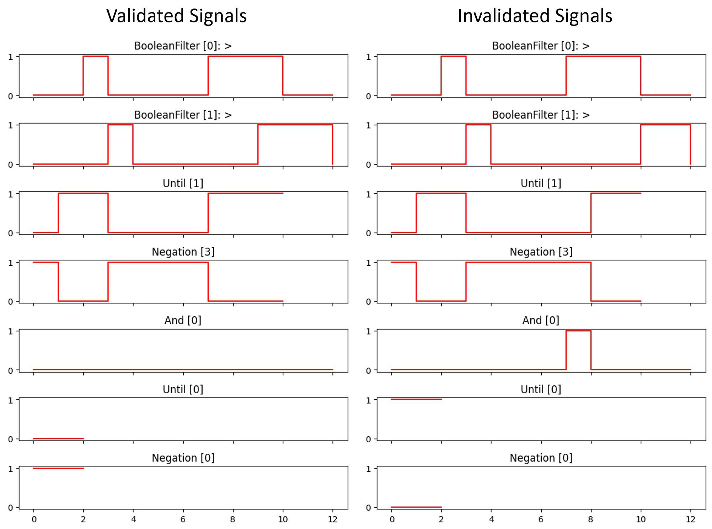
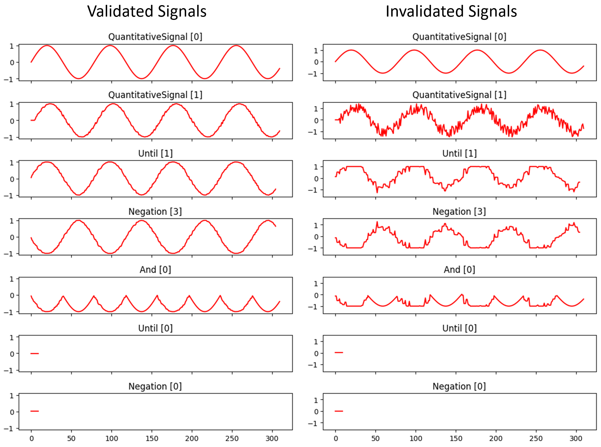
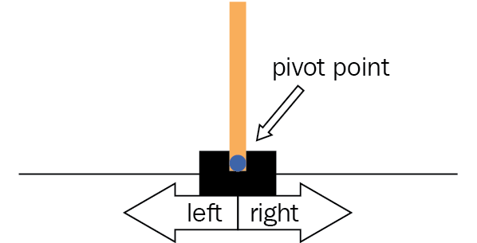
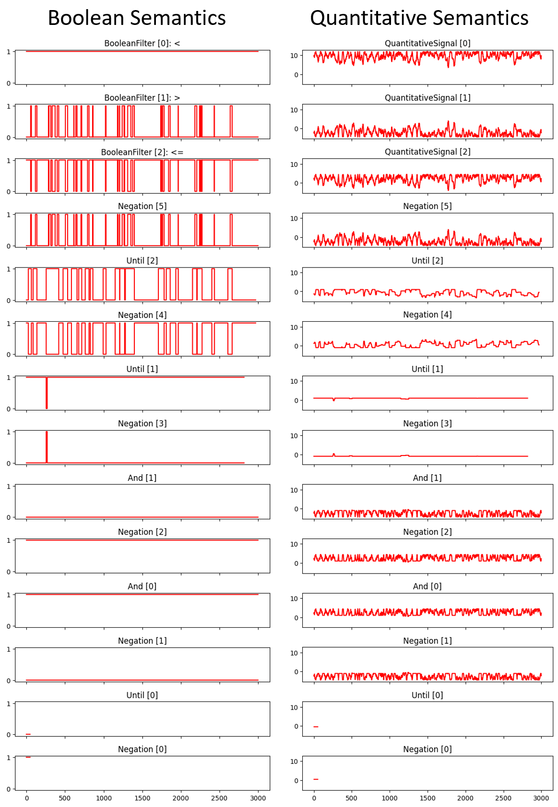

# STL-monitoring

An easy to use tool written in Python to perform Signal Temporal Logic monitoring is presented in this repository. Both validation with Boolean semantics and Robustness estimate computation with quantitative semantics are supported.
This tool is part of the Research Project "[Signal Temporal Logic Monitoring and Online Robustness Approximation](Signal%20Temporal%20Logic%20Monitoring%20and%20Online%20Robustness%20Approximation.pdf)" which is performed on the University of Antwerp.

## Introduction

Signal Temporal Logic (STL) is a Temporal Logic formalism for specifying properties of dense-time quantitative signals. Many real-life applications are working with continuous data and in those situations a yes or no as answer to a property that has to be verified is not enough. The yes/no answer is rather only satisfying in a discrete context. With that reason we focused on the optimization based approach. With STL it is possible to leverage the definition of quantitative semantics to compute the robustness estimate. This results in an optimization problem since the robustness has to be as high as possible, because the higher, the ``more satisfied" the property is.

## Installation

As it is a simple Python program, not much preparation is necessary:
1. Clone the repository
2. Install the necessary Python packages  
```pip install -r requirements.txt```

If the grammer of [stl.g4](stl.g4) has changed, the generated code by ANTLR can be updated with Java:  
```java -jar antlr-4.8-complete.jar -Dlanguage=Python3 stl.g4 -visitor``` 

## Usage

The actual STL-monitor can be used as follows:  

```python stl.py <formula file> <signals csv file> <semantic=boolean/quantitative>```
  
#### Parameters

- ```formula file``` is a simple text file with the STL formula that will be used.
- ```signals csv file``` is a csv file which includes all the used signals and their optional time steps.
- ```semantic``` is the used semantics provided as a string and can be either boolean (signal validation) or quantitative (robustness calculation). If none is given, the quantitative semantic context will be used.

#### Output

- Prints the resulting signal with its time steps and values.
- Makes a plot with subplots in which the signal is shown after each STL operation.
- Saves the STL tree that is created from the formula and used to perform the validation in [stlTree.dot](stlTree.dot). The tree is represented in the dot language and can be visualized using [WebGraphviz](http://www.webgraphviz.com/).

## Examples

Some examples are shown using both the boolean and quantitative semantic context.
The used operators are often different than the ones used in the formulas. This is because all operators are replaced with their equivalent notations consisting of the basic components of STL.

#### Boolean Semantics

The first examples are from the examples of [Monitoring Temporal Properties of Continuous Signals](https://www.researchgate.net/publication/220958490_Monitoring_Temporal_Properties_of_Continuous_Signals).
The used formula in the examples is: ```[]{0,10}((p>0)-><>{1,2}(q>0))```. The formula was used on a set of signals that is validated by the formula and on one that is not validated.
In the figure below, the generated plots for both examples are shown.

Commands to execute: 
- Validated signals: ```python stl.py formula.stl signals/ex_1a.csv boolean```
- Invalidated signals: ```python stl.py formula.stl signals/ex_1b.csv boolean```

(Do not forget to place the right formula in the ```formula.stl``` file)



#### Quantitative Semantics

The second pair of examples is also from [Monitoring Temporal Properties of Continuous Signals](https://www.researchgate.net/publication/220958490_Monitoring_Temporal_Properties_of_Continuous_Signals).
However, in this case a quantitative semantic context and formula is used: ```[]{0,300}(x1-><>{3,5}x2)```. The formula was used on a set of signals that is validated by the formula and on one that is not validated.
Keep in mind that using a quantitative context, not only the validation is checked, but also the robustness is calculated. In the figure below, the generated plots for both examples are shown.

Commands to execute: 
- Validated signals: ```python stl.py formula.stl signals/ex_sin1.csv quantitative```
- Invalidated signals: ```python stl.py formula.stl signals/ex_sin2.csv quantitative```

(Do not forget to place the right formula in the ```formula.stl``` file)



The resulting signals (last subplot in each figure) look very similar but are very different! In the validated example, it is a constant signal with a value of 0.022. This positive value indicates that the signals were validated by the formula, i.e. they are robust. In the invalidated example, the constant value is -0.028. Thus indicating it is not robust nor validated.

#### Cart-pole Example

To use the monitor in a more useful scenario, a Reinforcement Learning agent was trained to solve the [cart-pole scenario](https://gym.openai.com/envs/CartPole-v0/) as shown in the figure below. The goal of this task is to move the cart from left to right to keep the pole from falling.



When the agent was doing this task, the angle of the pole was extracted. This signal was then used to verify a typical stabilization property. The output of the angle should never go out of the interval [-12, 12] because then it is considered that the pole will fall, except for the first 150 time steps when the agent starts moving the cart. To make sure the agent is able to hold the pole fairly steady, the angle of the pole should only leave the interval [-4.5, 4.5] for a brief period. We define brief as: the angle has to return into the interval for at least 30 time steps within the next 150 time steps from the moment the angle left the interval. As we don't want it to go constantly very hard left and very hard right, the ``at least 30 time steps" is included. This way it has to have a steady period for a short time. In Boolean semantics, the formula then looks like:  

```[]{150,2950}(((|e5|) < 12) & ((|e5| > 4.5) -> <>{0,150}[]{0,30}(|e5|<=4.5)))``` 

When working with quantitative semantics, you want to avoid comparing operators, or Boolean "filters", as much as possible. If they are used, the signal is Booleanized and that causes information loss. Thus, using the same formula is not the best option. It is possible to simplify these comparisons. In quantitative semantics, it is considered that a positive value means that the formula is validated. So for instance x > n becomes x - n and it will have the same result in different semantics. Using this simplification, the formula looks like:

```[]{150,2950}(((12 - |e5|)) & ((|e5| - 4.5) -> <>{0,150}[]{0,30}(4.5 - |e5|)))```

The output of the tool can be seen in the figure below. The commands to execute these examples are:
- Boolean: ```python stl.py formula.stl signals/angles_ac_cart-pole.csv boolean```
- Quantitative:  ```python stl.py formula.stl signals/angles_ac_cart-pole.csv quantitative```

(Do not forget to place the right formula in the ```formula.stl``` file)

It's clearly visible that every time a signal is negative in the quantitative semantics, the Boolean variant is False on the same time steps. Both semantics claim that the formula is satisfied in this example. The quantitative results looks very close to zero, but is effectively around 0.5 over all the 50 remaining time steps.

